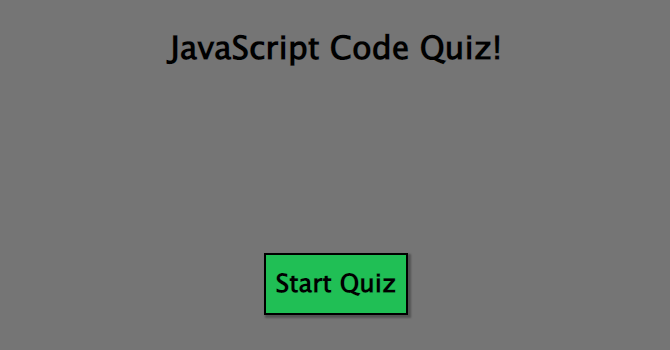

# JavaScript Code Quiz

## Description

This project pushed me to the edge and had me questioning why I decided to try coding. This has been the most complex project to date. It relies heavily on using JacaScripts dynaminc HTML capabilities as well as utilizing the localStorage feature to keep track of high scores if played more than one time.

DEPLOYED SITE HERE

## Installation

N/A

## Usage

JavaScript here, there, and everywhere

## Credits

William K for helping me code the clearing of the displayed highscores list upon page refresh.

## License

N/A
